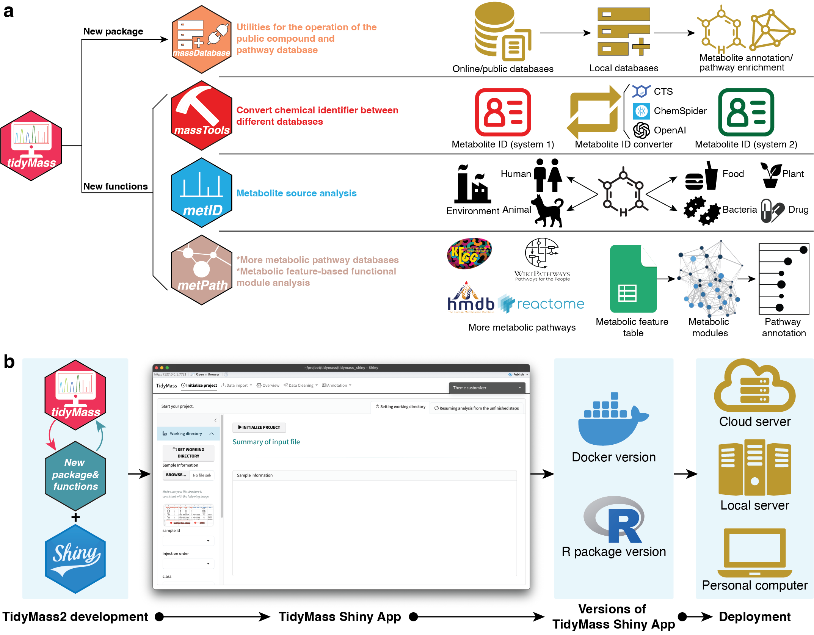

# Code for tidymass2 manuscript



There are 5 folders in this repository:

## 1_code

All the code used to generate the figures and tables in the manuscript.

## 2_data 

All the raw data used to generate the figures and tables in the manuscript.

## 3_data_analysis 

All the data analysis results used to generate the figures and tables in the manuscript.

## 4_manuscript 

The figures and supplementary figures.

## 5_summary 

The summary of the project.

## Packages you need to install before run the code

```r
if (!requireNamespace("remotes", quietly = TRUE)){
install.packages("remotes")
}

if (!requireNamespace("r4projects", quietly = TRUE)){
remotes::install_github("jaspershen-lab/r4projects")
}

if (!requireNamespace("tidymass", quietly = TRUE)){
remotes::install_github("tidymass/tidymass")
}
```